# Aplat

[](https://github.com/alarboulletmarin/aplat/actions/workflows/ci.yml)
[](LICENSE)

**Generative wallpapers, computed entirely in your browser and exported at your
device's exact resolution.**

Free, with no account, no ads, no tracking and no server. Nothing leaves your
device: everything shareable fits in the URL, and the app is installable and
fully usable offline.

[Version française](README.fr.md)

<p align="center">
  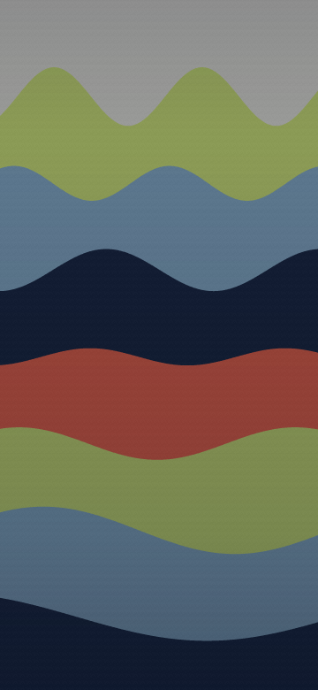
  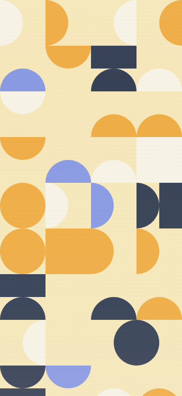
  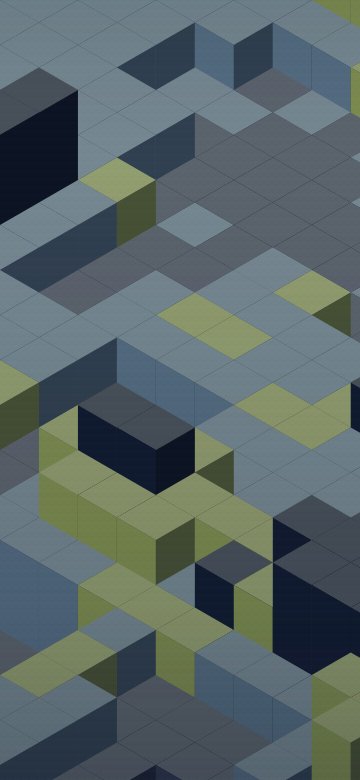
  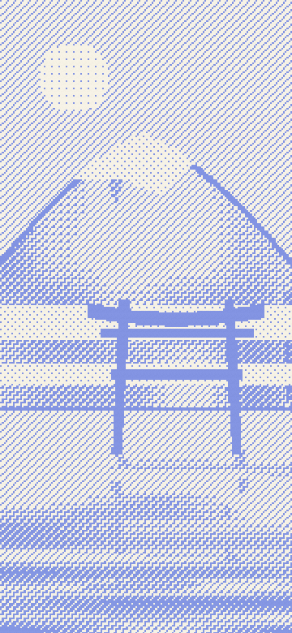
  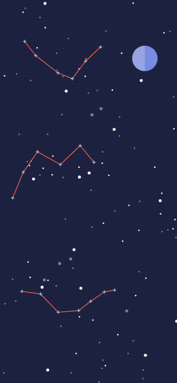
</p>

## Table of contents

- [Highlights](#highlights)
- [Gallery](#gallery)
- [One pattern, several formats](#one-pattern-several-formats)
- [Try it](#try-it)
- [How it works](#how-it-works)
- [Privacy](#privacy)
- [Development](#development)
- [Documentation](#documentation)
- [Contributing](#contributing)
- [License](#license)

## Highlights

- **Preview behind real icons.** The whole point of the product: you see the
  wallpaper behind a mock home screen before you download, and a readability
  probe reports the measured contrast ratio of icon labels at all times.
- **Exact resolution.** Your screen size is detected; any resolution can be
  typed in. The preview and the exported file are the same drawing at two
  scales, and that equality is verified by tests.
- **76 pattern families** in five groups (abstract, materials, landscapes,
  landmarks, figures), **11 hand-tuned palettes**, three density levels, and
  custom palettes of three to six colors.
- **Deterministic engine.** `(family, palette, density, seed)` always produces
  the same image, at any resolution. Sharing a link is sharing the image.
- **Several outputs**: PNG, PNG 2x, WebP, SVG, clipboard copy, and a
  phone-tablet-desktop batch from the same seed.
- **Light and dark variants**, baked into the exported file, not simulated.
- **Installable PWA**, fully functional offline, with React as the only
  runtime dependency.
- **Accessibility as a floor**: WCAG contrasts computed on the real DOM, full
  keyboard support, visible focus, 44 px touch targets and reduced motion,
  all enforced by the repository's own tooling.

## Gallery

Ten of the seventy-six families. Every image in this README comes out of the
engine itself, with a fixed seed, and is regenerated identically by
`node tools/vitrine.mjs`: none of them can promise a render the app would not
produce.

| | | | | |
|:---:|:---:|:---:|:---:|:---:|
|  |  | 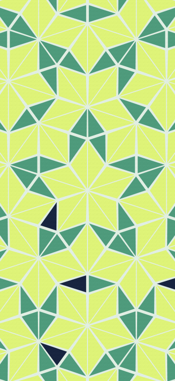 |  | 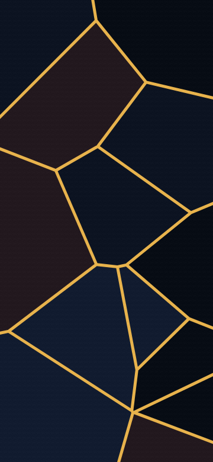 |
| Waves | Half-moons | Penrose | Blocks | Kintsugi |
| 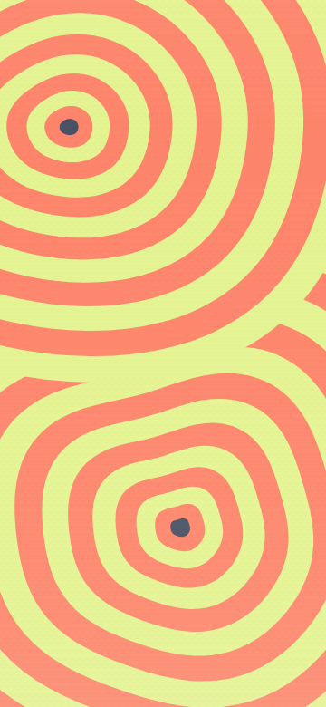 | 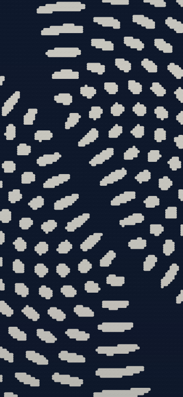 | 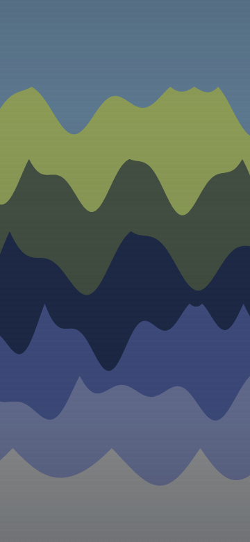 |  |  |
| Growth rings | Moiré | Dunes | Torii | Constellations |

## One pattern, several formats

The PNG at your screen's resolution is the primary action: it is the
wallpaper. The other outputs serve other uses, and the same pattern
(`Meanders`, `Night` palette, seed 7314) looks like this in each of them,
here at 590 × 1278:

| PNG, 295 KB | WebP, 31 KB | SVG, 38 KB |
|:---:|:---:|:---:|
|  | 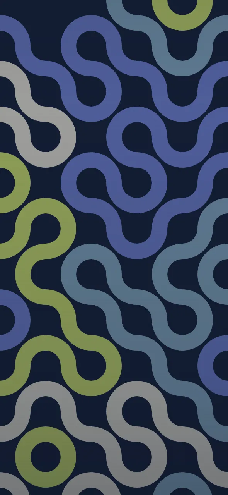 |  |

| Output | What it is for |
|---|---|
| **PNG** | the wallpaper, at the detected or typed-in resolution |
| **PNG 2x** | the same image for a screen you do not know yet |
| **WebP** | the same wallpaper, two to three times lighter, to send around |
| **SVG** | no longer a wallpaper but a pattern, to reuse elsewhere |
| **Three devices** | the same seed as phone, tablet and desktop, in one go |
| **Copy image** | a PNG in the clipboard, the shortest path to a conversation |

Every pattern also exists as a **dark variant**: the same drawing brought to a
target darkness in the file itself, so that all palettes come out equally
dark. Here `Peaks` on the `Sun` palette, light and dark:

| Light | Dark |
|:---:|:---:|
| 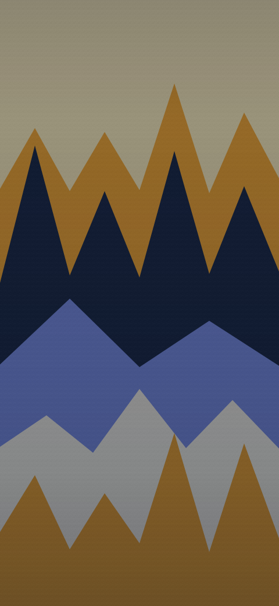 | 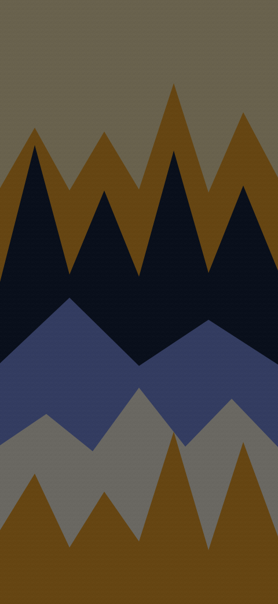 |

## Try it

```bash
git clone https://github.com/alarboulletmarin/aplat.git
cd aplat
npm install
npm run dev
```

Three routes: `/` presents the project, `/app` runs it, `/moteur` explains how
it works, step by step, with live renders.

The Service Worker is disabled in development. To try installation and
offline mode, build first:

```bash
npm run build
npm run preview
```

## How it works

The engine draws every shape in coordinates relative to the short side of the
canvas, so a pattern has no pixel size of its own: the on-screen preview and
the exported 4K file are the same image. After the shapes, a probe measures
the luminance of the icon area, picks the safest label color, and pushes the
background just enough for icon labels to stay readable; the resulting
contrast ratio is displayed, and the veil is applied only when it helps.

**The URL carries the state, and nothing else:**

```
/app?m=vagues&p=lime&d=1&s=7314&r=1179x2556
```

| Parameter | Meaning |
|---|---|
| `m` | family |
| `p` | palette |
| `d` | density (0 to 2) |
| `s` | seed |
| `r` | resolution, only when typed in by hand |
| `v=0` | only when the readability veil was removed from the file |
| `n=1` | only when the dark variant is exported |
| `k` | the colors of a custom palette, only when the pattern uses one |

Copying the link is enough to get exactly the same image on any device. A
forged URL can only produce a valid pattern: anything unrecognized falls back
to a default value.

The deeper rationale (what was tried and removed, why the app is a single
screen, how the dark variant and custom palettes are designed) lives in the
[design notes](docs/notes-de-conception.md) (in French).

## Privacy

No account, no network call at runtime, no analytics. No cookie, no
`sessionStorage`, no IndexedDB. The displayed pattern's settings live in the
address bar, and the device holds **four `localStorage` keys, and not one
more**:

| Key | Contents |
|---|---|
| `aplat:motifs` | the last ten viewed patterns, four settings each, plus up to six pins; no image, no timestamp, no identifier |
| `aplat:palettes` | hand-composed palettes, twelve at most, a name and three to six colors each |
| `aplat:langue` | the chosen interface language, one word, written only when chosen |
| `aplat:theme` | the chosen interface theme, one word, written only when chosen |

Everything is erasable from the interface. The exact contents of these keys
are verified field by field on every `npm run check`, and a fifth key fails
the check. The document's security policy (`connect-src 'none'`) cuts
`fetch`, XHR, WebSocket, EventSource and `sendBeacon`: "no network" is a
property of the document, not a promise. Fonts are self-hosted for the same
reason.

## Development

Requires **Node 22**. The stack is React 19, TypeScript and Vite; React is
the only runtime dependency.

```bash
npm install
npm run dev         # development server
npm run verify      # the exit gate: typography, types, lint, tests, build
npm run check       # the checks in a real browser (needs Chromium)

npm run test        # unit tests only
npm run typecheck   # types only
npm run lint        # React hooks rules, which tsc does not see
npm run build       # license notices + types + production build
npm run preview     # serves the build, Service Worker active
```

`verify` only needs Node; `check` needs Chromium
(`npx playwright install --with-deps chromium`), which is why it lives apart.
CI replays both, in two parallel jobs.

`npm run check` chains fifteen suites of headless checks: end-to-end
journeys, hostile URLs, real contrasts computed on the DOM, touch targets,
overflows with labels stretched by 30 %, offline installation, endurance,
performance budgets with the CPU throttled six-fold, and more. Each one is
described in [`tools/README.md`](tools/README.md).

### Repository layout

```
src/lib/          the generative engine: palettes, families, rendering, SVG, URL
src/components/   the interface, one file per piece
src/hooks/        clock, sizes, focus, fitting, data saving
src/i18n/         French and English labels, in strict parity
src/styles/       tokens, reset, base, components, screens
public/polices/   Anton and Archivo, self-hosted
tools/            headless verifications (never shipped)
scripts/          PWA icons, license notices
design/           the reference mockups
docs/             design notes and README images
```

## Documentation

| Document | Answers |
|---|---|
| [`CONTRIBUTING.md`](CONTRIBUTING.md) | what the project refuses, and how it is written |
| [`DESIGN_SYSTEM.md`](DESIGN_SYSTEM.md) | the interface reference, tokens included |
| [`docs/notes-de-conception.md`](docs/notes-de-conception.md) | the design notes: why each choice was made |
| [`CHANGELOG.md`](CHANGELOG.md) | what each version changes for the person using it |
| [`SECURITY.md`](SECURITY.md) | how to report a vulnerability, and what is not one |
| [`CODE_OF_CONDUCT.md`](CODE_OF_CONDUCT.md) | what is expected in interactions |
| [`tools/README.md`](tools/README.md) | what each verification verifies, and how to replay it |

The interface is fully bilingual (French and English), and the documents of
record are written in French, as are the code's identifiers: see
[`CONTRIBUTING.md`](CONTRIBUTING.md) before opening a pull request.

## Contributing

Contributions are welcome. Read [`CONTRIBUTING.md`](CONTRIBUTING.md) first: it
states what the project refuses on principle (accounts, tracking, gamification,
notifications, component libraries, more than one primary action per screen),
the rules that hold the code together, and what is expected of a pull request.
Bugs go through the [issues](https://github.com/alarboulletmarin/aplat/issues);
vulnerabilities through [`SECURITY.md`](SECURITY.md).

## License

The code is released under **AGPL-3.0-only** ([`LICENSE`](LICENSE)). The app's
footer links to the exact commit its build came from: that is what the AGPL
calls the corresponding source.

The Anton and Archivo fonts are under the SIL Open Font License 1.1
(`public/polices/OFL-Anton.txt`, `public/polices/OFL-Archivo.txt`). The
licenses of third-party components embedded in the build are collected into
`public/THIRD-PARTY.txt` at every `npm run build`.
